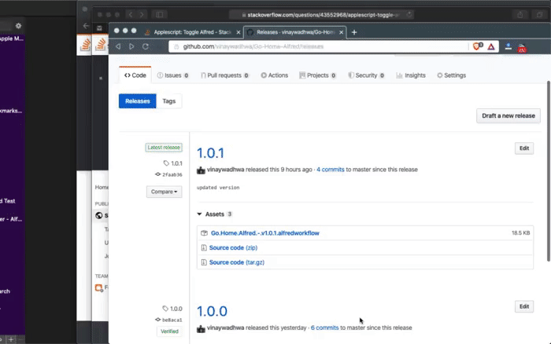

# Go Home, Alfred
An Alfred workflow which enables you to use a keyboard shortcut to go to the homepage of a website you are on.

Do you often get stuck deep inside the rabbit hole (of a website) and come out by either 
- backspacing the URL a gazillian times to go to the home page 
- or by clicking the website logo usually on the top left

UGHH! make it a keyboard shortcut with this Alfred workflow!

## ✅ Install

- Download and open the workflow file using [Alfred](https://www.alfredapp.com/).
- Get the latest release from here : https://github.com/vinaywadhwa/Go-Home-Alfred/releases

P.S.: You need to [buy the Powerpack](https://buy.alfredapp.com/) to use this workflow.

## 🌐 Supported Browsers
- Safari
- Google Chrome
- Google Chrome Canary
- Opera
- Vivaldi
- Brave Browser

### 🗒 Note
- Firefox not supported, for now, sorry! [This](https://www.alfredforum.com/topic/2013-how-to-get-frontmost-tab%E2%80%99s-url-and-title-of-various-browsers/) is why.
- Please reach out if you need other Chrome/Safari based browsers supported.

## 👬 Contribution

- Report issues
- Open pull request with improvements
- Spread the word
- Reach out with any feedback 
- Buy me a beer 

## 🏅 License

